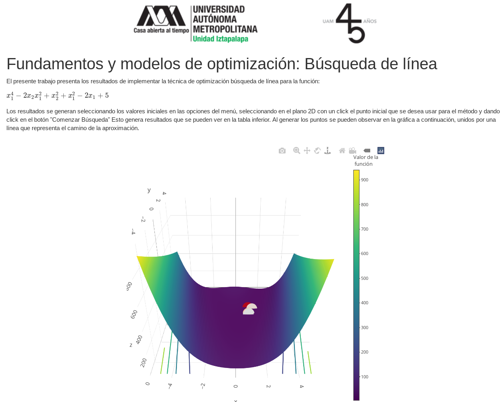
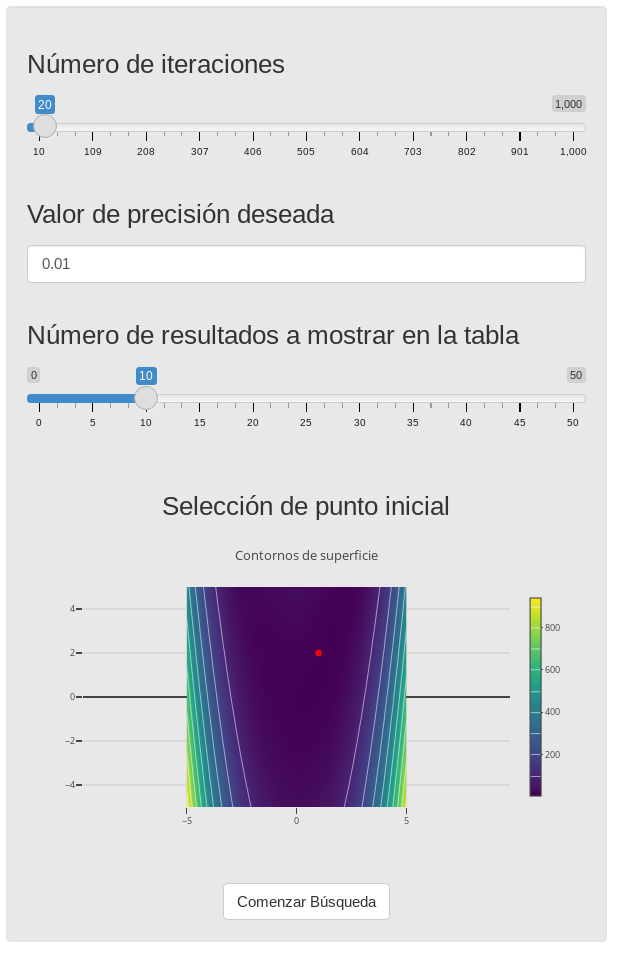
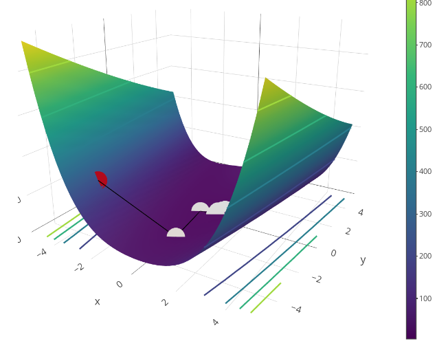
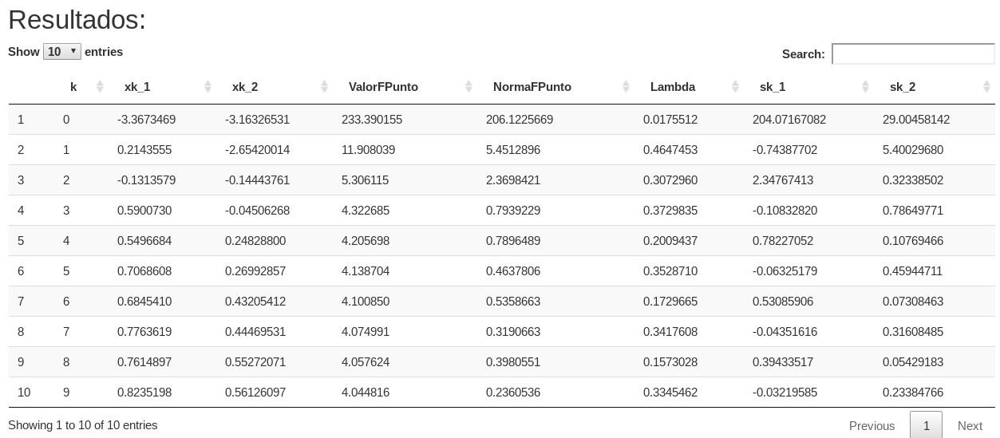

# shiny-line-search
## Implementación en R de un algoritmo de búsqueda de línea

El presente repositorio ejemplifica el uso de Shiny en Rstudio para implementar una aplicación web responsiva que sirve de front end para un algoritmo de búsqueda para una función multivariada.

La aplicación se puede configurar usando el panel lateral izquierdo:

Tras iniciar una ejecución usando el botón *Comenzar Búsqueda* se puede apreciar el recorrido realizado hasta alcanzar la precisión deseada en la gráfica:

Los resultados igual se presentan en una tabla
